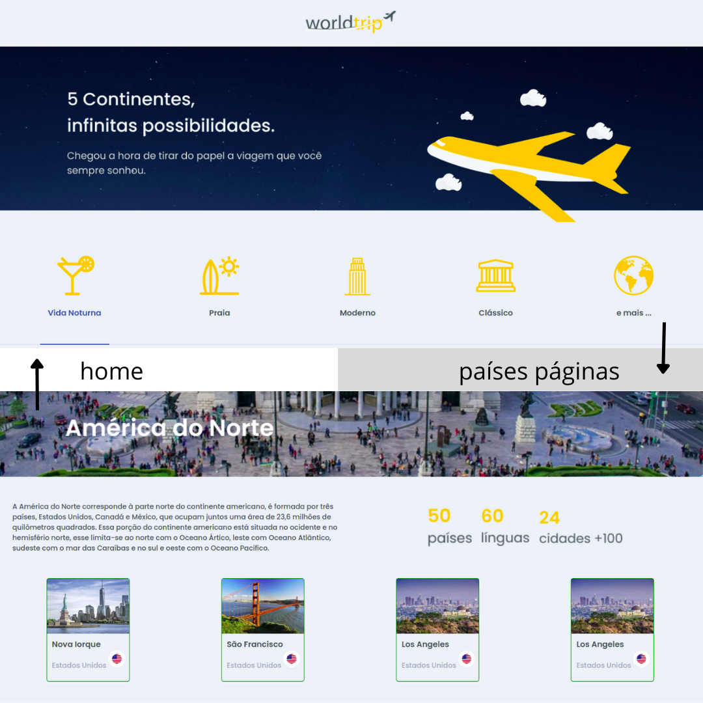

## Preview



## Getting Started

First you can test here in this link (deploy) [World-Trip](https://world-trip-seven.vercel.app/)

If you prefer, run the development server:

```bash
npm run dev
# or
yarn dev
```

Open [http://localhost:3000](http://localhost:3000) with your browser to see the result.

## Thanks RocketSeat

Another project accomplished and a lot of learning.


